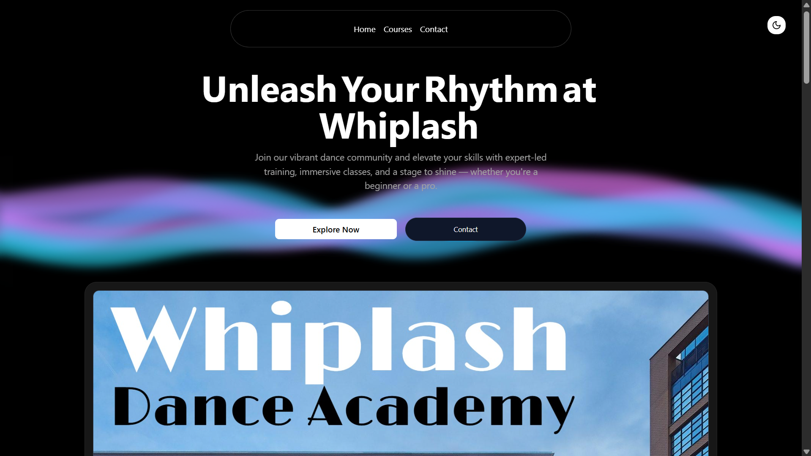
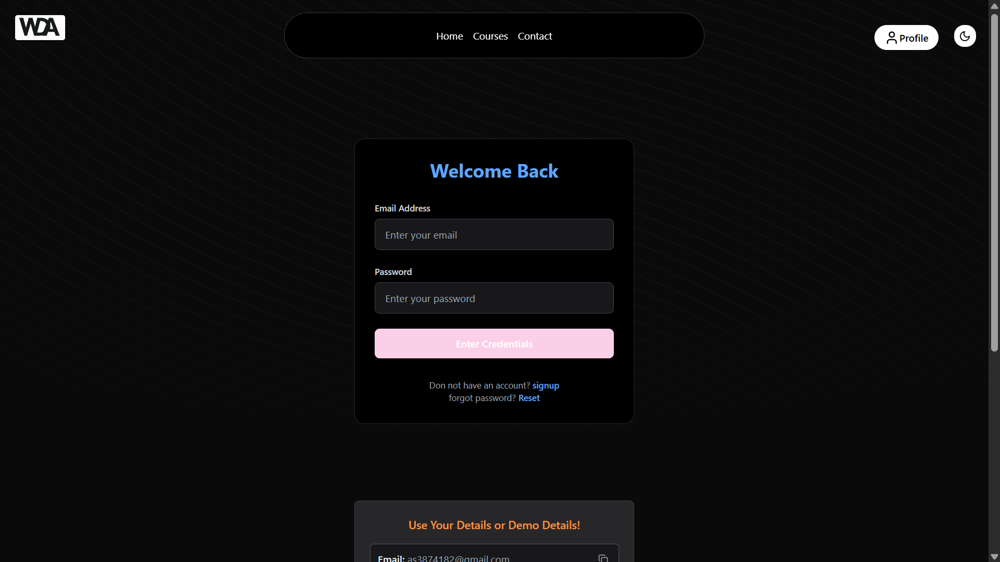
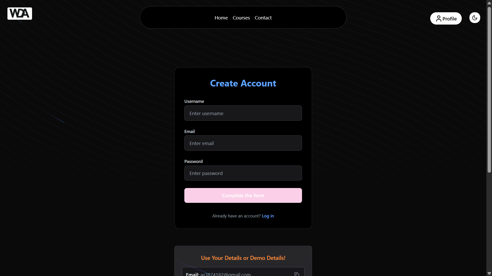
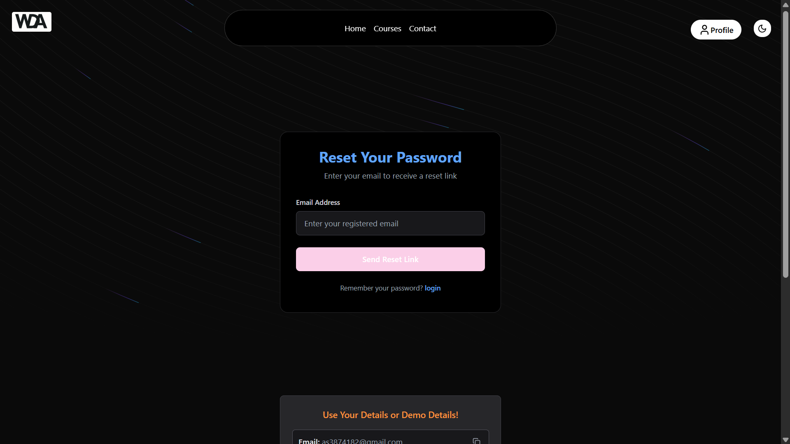
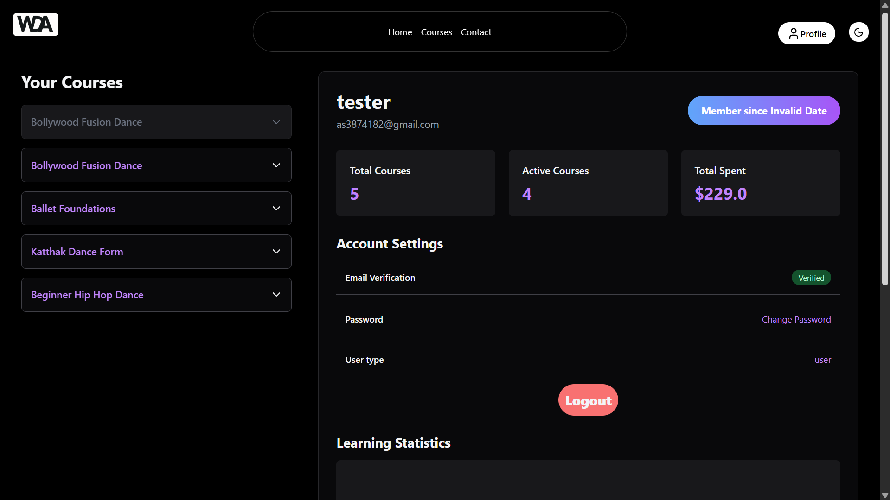
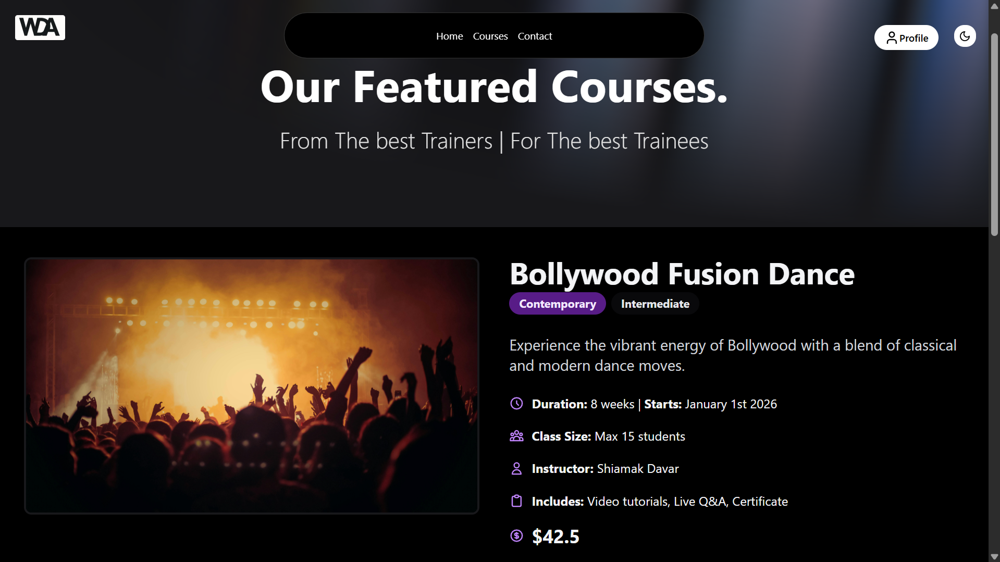
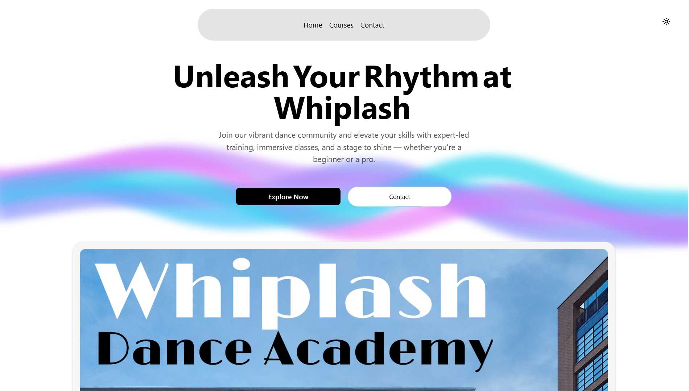
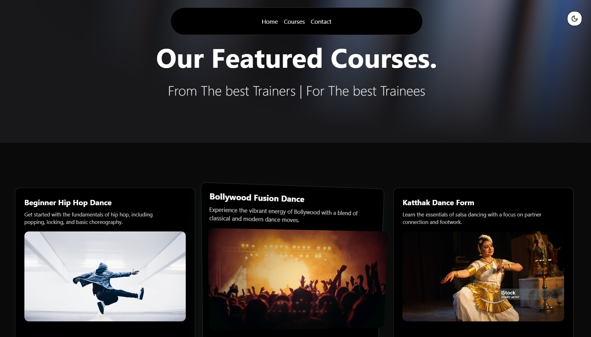

<h1>🕺 Whiplash Dance Academy – Official Website</h1>
<h2>
  <a href="https://whiplash-dance-academy.vercel.app/">🔗Live demo : https://whiplash-dance-academy.vercel.app/</a>
</h2>

A modern, fully responsive website built for <strong>Whiplash Dance Academy</strong> using <strong>Next.js</strong>, <strong>TypeScript</strong>, and <strong>Tailwind CSS</strong>. The project features stunning UI with <strong>Aceternity UI components</strong>, interactive <strong>3D visuals</strong>, <strong>light/dark theme support</strong>, complete <strong>user authentication system</strong>, and a working <strong>contact form with email integration</strong>.

<h2>✨ Features</h2>
<ul>
  <li><strong>Complete Authentication System</strong> with JWT and cookies</li>
  <li><strong>Email verification</strong> for new account registration</li>
  <li><strong>Password recovery</strong> (forgot & reset password flows)</li>
  <li><strong>Customer profiles</strong> with personal dashboard</li>
  <li><strong>Course pages</strong> with detailed information and enrollment</li>
  <li>Beautiful UI built with <strong>Aceternity UI</strong></li>
  <li><strong>Light/Dark theme</strong> toggle using <code>next-themes</code></li>
  <li>Immersive <strong>3D components</strong> for visual engagement</li>
  <li><strong>Contact form with email functionality</strong> via Nodemailer</li>
  <li>Fully <strong>responsive design</strong> optimized for all screen sizes</li>
  <li>Clean, modular codebase with <strong>TypeScript</strong></li>
  <li>SEO-friendly and fast-loading pages</li>
</ul>

<h2>🔐 Authentication Pages Preview</h2>
<table>
  <thead>
    <tr><th>Page</th><th>Description</th><th>Features</th></tr>
  </thead>
  <tbody>
    <tr>
      <td>Login</td>
      <td>User authentication</td>
      <td>Email/password, social login, remember me</td>
    </tr>
    <tr>
      <td>Register</td>
      <td>New account creation</td>
      <td>Form validation, email verification</td>
    </tr>
    <tr>
      <td>Forgot Password</td>
      <td>Password recovery</td>
      <td>Email reset link, security checks</td>
    </tr>
    <tr>
      <td>Reset Password</td>
      <td>Set new password</td>
      <td>Token validation, password strength</td>
    </tr>
    <tr>
      <td>Verify Email</td>
      <td>Account verification</td>
      <td>Expiration handling, resend option</td>
    </tr>
    <tr>
      <td>Profile</td>
      <td>User dashboard</td>
      <td>Personal info, enrolled courses, settings</td>
    </tr>
  </tbody>
</table>

<h2>⚙️ Tech Stack</h2>
<table>
  <thead>
    <tr><th>Technology</th><th>Description</th></tr>
  </thead>
  <tbody>
    <tr><td>Next.js</td><td>React-based framework for the web</td></tr>
    <tr><td>TypeScript</td><td>Strongly typed JavaScript</td></tr>
    <tr><td>Tailwind CSS</td><td>Utility-first CSS framework</td></tr>
    <tr><td>Aceternity UI</td><td>Interactive & animated UI components</td></tr>
    <tr><td>next-themes</td><td>Theme switching for Next.js</td></tr>
    <tr><td>next-auth</td><td>Authentication library for Next.js</td></tr>
    <tr><td>jsonwebtoken</td><td>JWT implementation</td></tr>
    <tr><td>Nodemailer</td><td>Email sending for auth and contact forms</td></tr>
    <tr><td>MongoDB</td><td>Database for user and course data</td></tr>
    <tr><td>bcryptjs</td><td>Password hashing</td></tr>
  </tbody>
</table>

<h2>📬 Environment Configuration</h2>

To enable all functionality:

<ol>
  <li>Enable <strong>2-Step Verification</strong> on your Gmail account.</li>
  <li>Generate an <strong>App Password</strong> from your Google account.</li>
  <li>Create a <code>.env.local</code> file in your project root and add:</li>
</ol>

<pre><code># Configurations
SMTP_HOST=smtp.gmail.com
SMTP_PORT=587
MY_EMAIL = <youtData>
MY_PASSWORD = <youtData>
MONGO_URI = <youtData>
DOMAIN = http://localhost:3000
TOKEN_SECRET = <youtData>
NEXT_PUBLIC_SITE_NAME=MyDanceAcademy
</code></pre>

Restart the server to apply changes.

<h2>🚀 Getting Started</h2>

<h3>1. Clone the Repository</h3>
<pre><code>git clone https://github.com/yourusername/whiplash-dance-site.git
cd whiplash-dance-site</code></pre>

<h3>2. Install Dependencies</h3>
<pre><code>npm install</code></pre>

<h3>3. Start Development Server</h3>
<pre><code>npm run dev</code></pre>

<h3>4. Build for Production</h3>
<pre><code>npm run build
npm run start</code></pre>

<h2>🖼️ Screenshots</h2>

<h3>Authentication Flow</h3>

<h3>User Profile</h3>

<h3>Course Page</h3>

<h3>Theme Toggle</h3>

<h3>3D Component Section</h3>

<h2>📄 License</h2>

This project is licensed under the <strong>MIT License</strong>.

<h2>🤝 Contact</h2>

<strong>Ayush Kumar</strong> – <a href="mailto:ayushkumar8418@gmail.com">ayushkumar8418@gmail.com</a>

